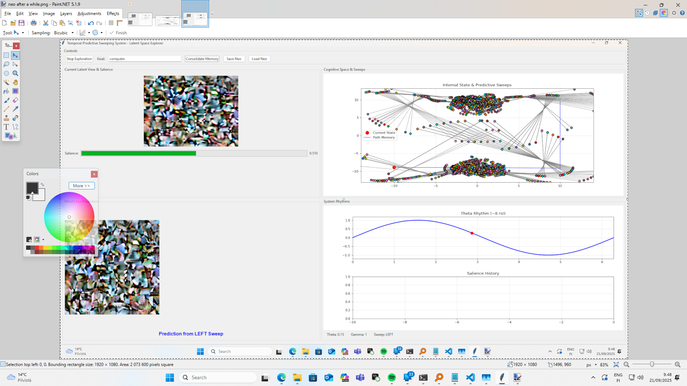
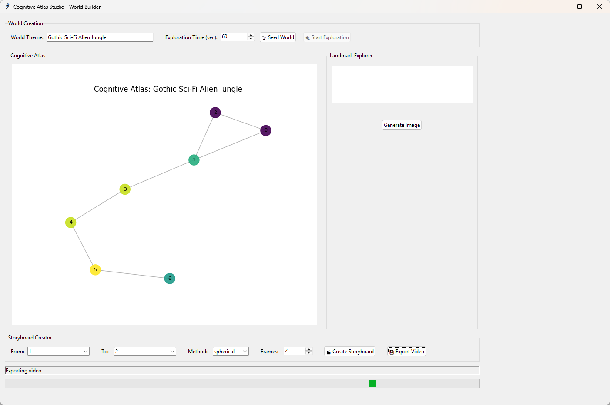
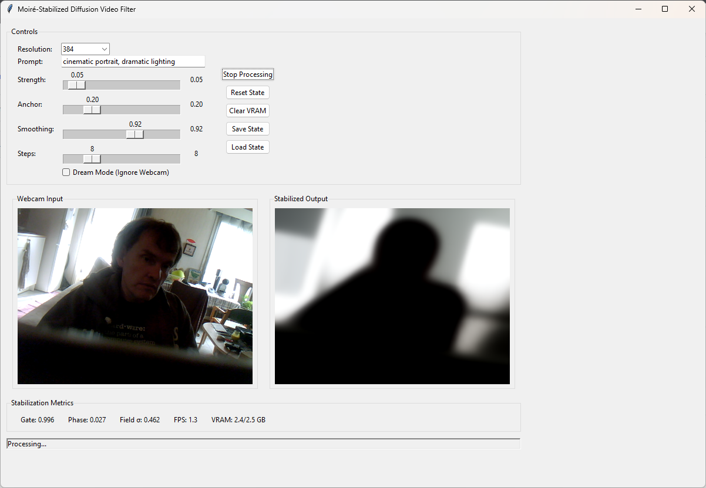

# Cognitive Atlas Studio: AI World-Builder & Storyboard Generator (vibecoded)

Video about it (I might not keep it up long): 

https://youtu.be/SHEkJ72S81M

An interactive application featuring a neuro-inspired AI agent ("Neo") that autonomously explores generative latent spaces, builds cognitive maps of its discoveries, and creates animated storyboards between concepts.

**Neo Unified System Architecture** 


**Cognitive Atlas Explorer Visualization**


**Matrix7 VAE Interface**


## Overview

The Cognitive Atlas Studio combines neuroscience-inspired algorithms with generative AI to create an autonomous creative agent. Instead of simply responding to prompts, Neo actively explores conceptual spaces, forms memories, and builds a structured understanding that can be used for creative collaboration.

## Features

### 🧠 Autonomous Exploration
- **Neo Agent**: AI that explores VAE latent spaces using brain-inspired theta rhythms and predictive sweeps
- **Theme-Based Seeding**: Give Neo a creative theme and watch it autonomously discover related concepts
- **Temporal Memory**: Neo records episodic traces of its exploration journey

### 🗺️ Cognitive Atlas Construction
- **Memory Consolidation**: Neo processes its experiences to identify stable concepts (landmarks)
- **Graph-Based Knowledge**: Builds a navigable map connecting related ideas
- **Interactive Visualization**: Explore Neo's learned cognitive map in real-time

### 🎬 Creative Storyboard Generation
- **Path Planning**: Select start and end concepts for Neo to connect
- **Smooth Interpolation**: Multiple interpolation methods (linear, spherical, bezier) for transitions
- **Video Export**: Generate MP4 animations of conceptual journeys

### 🎨 Formless VAE Exploration (Matrix7)
- **Direct VAE Manipulation**: Explore latent space without full Stable Diffusion pipeline
- **Real-time Visualization**: See abstract forms and concepts as they emerge
- **Moiré Stabilization**: Advanced temporal stabilization for smooth video generation

## Project Structure

This repository contains three main components:

1. **`Neo_Unified3.py`** - Core cognitive architecture and AI agent
2. **`CognitiveAtlasStudio.py`** - Cognitive Atlas Studio GUI application  
3. **`Matrix7.py`** - Formless VAE explorer with temporal stabilization

## Installation

### Prerequisites
```bash
pip install torch torchvision diffusers transformers
pip install numpy opencv-python pillow scikit-learn
pip install matplotlib networkx tkinter
```
Does use Triton Monkeypatch, which may turn out to be a pain in the ass 
to install as I have it. You guys might have to drop things to ai and ask it to make things 
work for you. 

### GPU Requirements
- CUDA-compatible GPU recommended for real-time performance
- Minimum 8GB VRAM for full functionality
- CPU fallback available with reduced performance

## Usage

### Running the Cognitive Atlas Studio

**Important**: `CognitiveAtlasStudio.py` requires `Neo_Unified3.py` to be in the same folder.

```bash
python Matrix_Studio2.py
```

### Running the Formless VAE Explorer

```bash
python Matrix7.py
```

### Basic Workflow

1. **Seed a World**: Enter a creative theme (e.g., "Gothic Sci-Fi Alien Jungle")
2. **Start Exploration**: Let Neo autonomously explore for 60+ seconds
3. **Consolidate Memory**: Process Neo's experiences into landmarks
4. **Explore the Atlas**: Click on nodes to generate images of discovered concepts
5. **Create Storyboards**: Select start/end points to generate animated transitions
6. **Export Videos**: Save your storyboards as MP4 files

## Scientific Foundation

This project implements several neuroscience-inspired concepts:

### Temporal Predictive Sweeping
Based on hippocampal theta rhythms, Neo explores using alternating left-right "sweeps" that predict what might be discovered in each direction.

### Memory Consolidation
Simulates the brain's sleep consolidation process, where episodic memories (path traces) are processed into structured semantic knowledge (the cognitive atlas).

### Cognitive Mapping
Implements a graph-based representation similar to cognitive maps in neuroscience, where concepts (nodes) are connected by learned associations (edges).

### Hierarchical Processing
Multiple temporal scales process information simultaneously, from immediate sensory input to long-term planning and goal-directed behavior.

## Controls

### Cognitive Atlas Studio
- **World Theme**: Text description of the conceptual space to explore
- **Exploration Time**: Duration for autonomous exploration (10-300 seconds)
- **Interpolation Method**: Choose between linear, spherical, or bezier transitions
- **Frame Count**: Number of frames for storyboard generation (30-300)

### Matrix7 VAE Explorer
- **Strength**: How much the AI transforms the input (0.0-1.0)
- **Anchor**: Temporal stability vs. responsiveness (0.0-1.0)
- **Smoothing**: Memory persistence across frames (0.8-0.99)
- **Dream Mode**: Pure latent exploration without webcam input

## Technical Details

### Memory Architecture
- **Episodic Memory**: Temporary sequence of exploration states
- **Semantic Memory**: Consolidated cognitive atlas of stable concepts
- **Working Memory**: Current state and immediate predictions

### Stabilization Algorithms
- **Moiré Field Detection**: Identifies movement between frames
- **Holographic Slow Fields**: Maintains temporal coherence
- **Phase-Based Gating**: Reduces noise during stable periods

### Planning System
- **Dijkstra Pathfinding**: Finds optimal routes through the cognitive atlas
- **Waypoint Following**: Guides exploration toward specific goals
- **Multi-scale Sweeping**: Predicts outcomes at multiple temporal horizons

## File Dependencies

```
├── Neo_Unified3.py          # Core AI agent and cognitive architecture
├── Matrix_Studio2.py        # Main GUI application (depends on Neo_Unified3.py)
├── Matrix7.py              # Standalone VAE explorer
└── README.md               # This file
```

**Critical**: `Matrix_Studio2.py` imports classes directly from `Neo_Unified3.py` and will not function without it in the same directory.

## Video Documentation

For a detailed walkthrough and demonstration, see the accompanying YouTube video that explains the concepts and shows the system in action.

## Research Background

This project explores the intersection of:
- Computational neuroscience and artificial intelligence
- Generative models and latent space exploration  
- Memory consolidation and cognitive mapping
- Autonomous agents and creative collaboration

Inspired by ton of papers and endless back and forth between AI's and me. The left right theta sweep paper: 

https://www.nature.com/articles/s41586-024-08527-1.pdf

The work draws inspiration from research on hippocampal function, predictive processing, and the role of theta rhythms in spatial navigation and memory formation.

